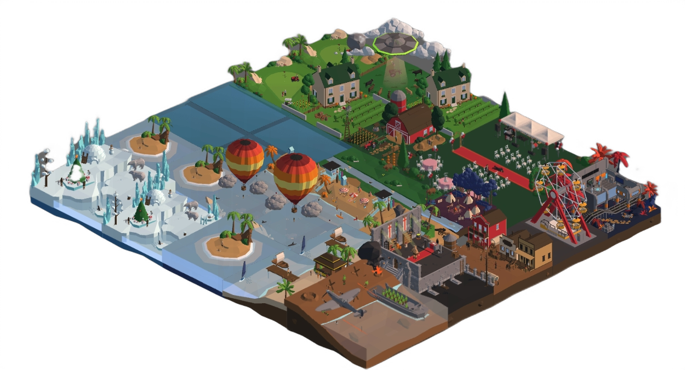
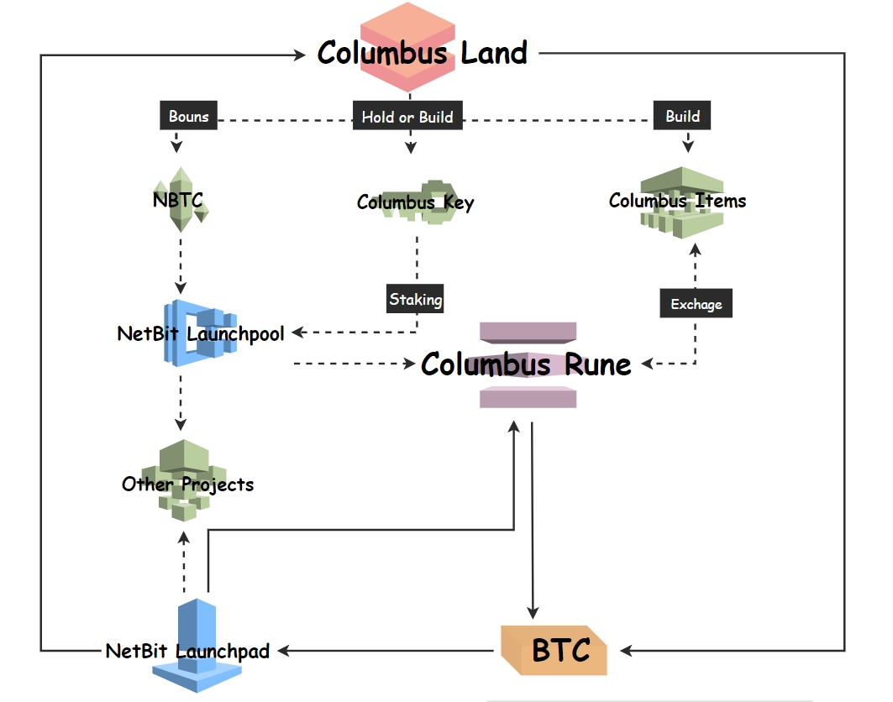

# Columbus Land

## Background

With the advent of the Metaverse era, people are increasingly investing their attention and resources into the digital virtual world. One of the major investments is purchasing digital land to create their own new world. These digital lands serve as creative canvases, allowing users to create their ideal cities through runes, crafting futuristic buildings and stunning virtual landscapes of their own design. The digital world is changeable and defined by users themselves.&#x20;

Columbus of Netbit Chain combines the Ordinals and Runes protocols to establish the New World created freely by players, full of possibilities for unlimited creation. In Columbus, wherever you are, you can create and use the space as you like. Users can freely exchange and share personal spaces, communities, villages, or even entire cities. Moreover, users can organize and join various activities in Columbus, including parties, fashion shows, music festivals, and art exhibitions, making your digital world richer and more fun.&#x20;

It is possible to explore the digital world without limits in Columbus, Users not only enjoy the pleasure of construction and management but also have the opportunity to earn substantial profits.

## About Columbus Land

Columbus Land is the first BRC-404 collection issued on the NetBit Launchpad. It includes diverse lands such as mines, financial buildings, hospitals, stores, concert halls, playgrounds, parks, and more, each with income-generating potential. These lands will be issued in limited quantities to ensure their scarcity and value, The total supply of lands is 10,000.

As Columbus continues to develop, the land will bring continued value growth and additional income to its holder. Columbus lands can be viewed in 360 degrees on the NetBit official website and multiple lands can be assembled. Columbus in NetBit will support popular Bitcoin protocols such as BRC-20, BRC-420, and Bitmap, allowing a wider user base to interact on Bitcoin Layer 2.


_**NOTE:**_ NetBit will launch Columbus Land in Q2 2024.


<figure><figcaption></figcaption></figure>

## Why Hold Columbus Land？

* _**Investment Potential:**_ Columbus land is a finite resource, and its value typically appreciates over time. Purchasing land can serve as a long-term investment, providing potential opportunities for future asset appreciation.&#x20;
* _**Development Potential:**_ Owning Columbus land means having the potential for development and utilization. In Columbus, Lands can be used for building houses, commercial purposes, agriculture, etc., providing opportunities for income and appreciation.&#x20;
* _**Control and Flexibility:**_ As a Columbus landowner, you have full control and flexibility over how you use and develop the land. You can customize the land's use according to your preferences, goals, and changing market conditions.&#x20;
* _**Passive Income:**_ Columbus land can generate passive income through various means such as leasing, renting, or developing the land for income-generating activities.&#x20;
* _**Participate in NetBit Ecosystem:**_ By holding land, users actively contribute to the development of the NetBit ecosystem. Columbus land can be traded on the market at any time.
* _**Keys Rewards:**_ Landholders and Land builders receive keys directly. By staking these keys to the NetBit Launchpool, they will receive airdrops of Columbus Rune.

<figure><figcaption></figcaption></figure>
