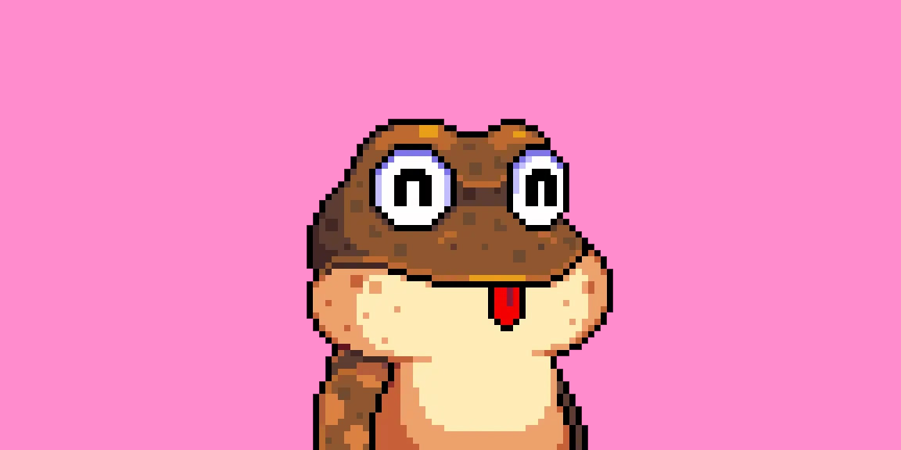
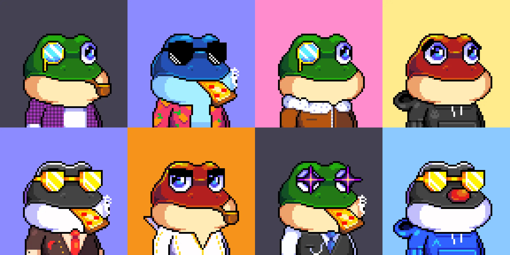
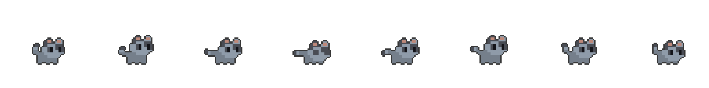

# 2D Inscription

## **Single Image Resource**

This is the essential attribute keyword necessary when the resource is a solitary 2D image file. Let's consider \[Bitcoin Frogs] as a pixel image for illustration.

<figure><figcaption></figcaption></figure>

```html
< sprite
    < !--required-- >
    name = "Bitcoin Frogs"
    infos = "It is an NFT of Bitcoin Frogs"
    src = "/content/4acc4304ab4b62855ad8540c4effd6f70410ce3gg50e7886109ad985dc2ba2642"
    format = "JPG"
    model_type = "truck"
    rect = (2.5, 10.3, 20, 20)
< sprite />
```

## **Single Basic Attributes**

The attributes reference table is provided below. Please review it thoroughly.

<table><thead><tr><th width="136">Key</th><th width="113">Required?</th><th>Description</th></tr></thead><tbody><tr><td>name</td><td>Yes</td><td>Resource name, which serves as the identifier for the resource.</td></tr><tr><td>infos</td><td>No</td><td>Description related to the resource.</td></tr><tr><td>src</td><td>Yes</td><td>On-chain address.</td></tr><tr><td>format</td><td>Yes</td><td>The file format of the original resource, supported formats include PNG, JPG, JPEG, TGA, BMP, TIFF.</td></tr><tr><td>model_type</td><td>Yes</td><td>Type of model the image is bound to (optional: wall, billboard, screen, standing sign...).</td></tr><tr><td>rect</td><td>Yes</td><td>Coordinates and dimensions of the image displayed on the model, parameters in sequence are x-coordinate, y-coordinate, width, height.</td></tr></tbody></table>



## Multiple Image Resources

If you have multiple 2D NFTs that you want to showcase in the same model, you can choose this approach. We will use Bitcoin Frog Collection as an example to provide an in-depth explanation of the attributes associated with multiple Image Resource Preview Templates.

<figure><figcaption></figcaption></figure>

```html
< sprite
    < !--required-- >
    name = "Bitcoin Frogs Collection"
    infos = "It is a collection of Bitcoin Frogs"
    src_map = { 
        "/content/4acc4304ab4b62855ad8540c4effd6f70410ce3gg50e7886109ad985dc2ba2642",
        "/content/4acc4304ab4b62855ad8540c4effd6f70410ce3gg50e7886109ad985dc2ba2643",
        "/content/4acc4304ab4b62855ad8540c4effd6f70410ce3gg50e7886109ad985dc2ba2644",
        "/content/4acc4304ab4b62855ad8540c4effd6f70410ce3gg50e7886109ad985dc2ba2645"
        }
    format = "JPG"

    < !--rect = (x, y, w, h)-- >
    model_type = "billboard"
    rect = (2.5, 10.3, 20, 20)
    interval = 0.5

< sprite />
```

## Multiple Attributes

The attributes reference table is provided below. Please review it thoroughly.

<table><thead><tr><th width="141">Key</th><th width="111">Required?</th><th>Description</th></tr></thead><tbody><tr><td>name</td><td>Yes</td><td>Resource name, which serves as the identifier for the resource.</td></tr><tr><td>infos</td><td>No</td><td>Description related to the resource.</td></tr><tr><td>src</td><td>Yes</td><td>On-chain address.</td></tr><tr><td>format</td><td>Yes</td><td>Supported formats include PNG, JPG, JPEG, TGA, BMP, TIFF.</td></tr><tr><td>model_type</td><td>Yes</td><td>Type of model the image is bound to (optional: wall, billboard, screen, standing sign...).</td></tr><tr><td>rect</td><td>Yes</td><td>Coordinates and dimensions of the image displayed on the model, parameters in sequence are x-coordinate, y-coordinate, width, height.</td></tr><tr><td>interval</td><td>Yes</td><td>Animation playback speed.</td></tr></tbody></table>



## Keyframe Animation Resource

If you have a 2D dynamic NFT, you can choose to showcase it in sequence frames on our NetBit platform. We'll use a jumping cat as an example.

<figure><figcaption></figcaption></figure>

```html
< sprite
    name = "jumping cat"
    infos = "It is a jumping cat"
    src = "/content/4acc4304ab4b62855ad8540c4effd6f70410ce3gg50e7886109ad985dc2ba2642"
	format="PNG"
    model_type = "wall"
    rect = (2.5,10.3,20,20) 
	< animation
		key="jump"
                row=1
		column=8
		frame_count=10
		interval=0.5
    < animation/>
< sprite/>
```

## Sequence Frame Animation Attributes

The attributes reference table is provided below. Please review it thoroughly.

<table><thead><tr><th width="151">Key</th><th width="114">Required?</th><th>Description</th></tr></thead><tbody><tr><td>name</td><td>Yes</td><td>Resource name, which serves as the identifier for the resource.</td></tr><tr><td>infos</td><td>No</td><td>Description related to the resource.</td></tr><tr><td>src</td><td>Yes</td><td>On-chain address.</td></tr><tr><td>format</td><td>Yes</td><td>Supported formats include PNG, JPG, JPEG, TGA, BMP, TIFF.</td></tr><tr><td>model_type</td><td>Yes</td><td>Type of model the image is bound to (optional: wall, billboard, screen, standing sign...).</td></tr><tr><td>rect</td><td>Yes</td><td>Coordinates and dimensions of the image displayed on the model, parameters in sequence are x-coordinate, y-coordinate, width, height.</td></tr><tr><td>animation</td><td>Yes</td><td>Optional parameter, supports uploading sprite sheets for animated display.</td></tr><tr><td>row</td><td>Yes</td><td>Number of rows in the sprite sheet.</td></tr><tr><td>column</td><td>Yes</td><td>Number of columns in the sprite sheet.</td></tr><tr><td>frame_count</td><td>Yes</td><td>Total number of frames in the animation.</td></tr><tr><td>interval</td><td>Yes</td><td>Animation playback speed.</td></tr></tbody></table>




