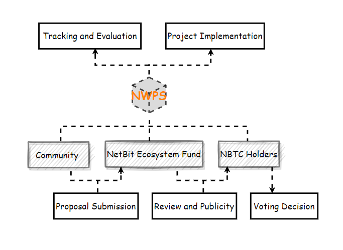

# NetBit Ecosystem

### NetBit Worker Proposal System - NWPS&#x20;

NWPS is a system based on decentralized proposals and referendums, designed to fully reflect the decentralized nature of NetBit. In addition to the directions supported by the NetBit official team, the NetBit ecosystem fund also enables community members to initiate fund requests through the NWPS system to support essential projects. This initiative aims to enhance the overall utility of NBTC and further optimize the NetBit ecosystem.

<figure><figcaption></figcaption></figure>

### NetBit Community Arbitration Forum - NCAF&#x20;

NCAF is a core arbitration body voluntarily formed by community members to handle various disputes and disputes. The platform aims to provide a fair, transparent, and efficient solution to promote and maintain a harmonious coexistence among holders.

Member Election and Management: Leaders and arbitrators are elected by community members to democracy and transparency in the decision-making process.

Rule Formulation and Adjustment: Transparent rules and procedures are formulated and adjusted as needed to maintain flexibility and adaptability.

Dispute Resolution Process: Provides a variety of solutions, including mediation, negotiation and arbitration, to meet the needs of community members and maintain harmonious coexistence.&#x20;

Transparency and Accountability: Ensure decision-making processes are transparent and accept supervision and review to enhance community trust and recognition of the platform.

### NetBit Ecosystem Incentive Program - NEIP

The NetBit Ecosystem Incentive Program aims to promote the growth and development of the NetBit ecosystem through a series of reward mechanisms, encouraging project integration, community contributions, and developer participation. The program covers various aspects such as project rewards, project promotion, community development funds, community contributor rewards, developer incentives, and partners. It ensures transparent and fair fund utilization, laying a solid foundation for the project's long-term success.

Developer Incentives: Encourage active developer participation by providing financial rewards, supporting technological innovation, and enhancing the ecosystem.

Project Rewards: Successfully integrated projects will receive NBTC fund airdrops for optimizing and developing project content, with regular submission of fund utilization reports and complimentary promotion services.

Community Development Fund: Aimed at promoting and expanding projects, optimizing social media, online, and offline activities, and reaching a broader international user base.

Community Contributors: Used to reward community members for their outstanding contributions to the project, including community builders and content creators.&#x20;

Referral Rewards: Users who successfully invite projects to join and integrate into NetBit will receive additional rewards, encouraging active contributions to the development of the NetBit ecosystem.

Partners: Promote cooperative development in various fields through mutually beneficial initiatives.
