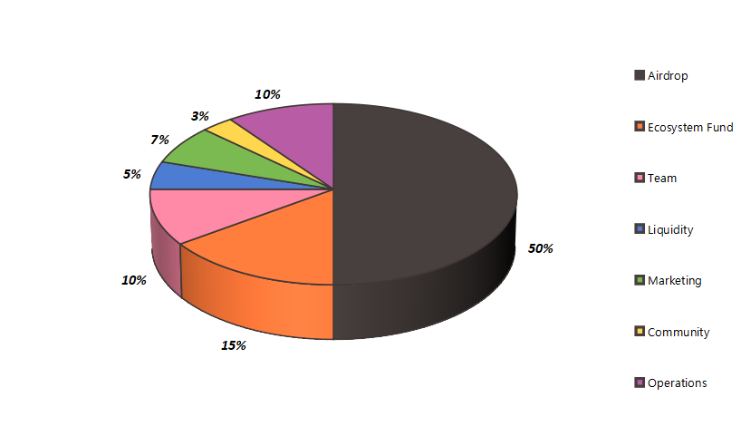

# Allocation & Release Schedule

NBTC supply is split in _**7**_ main groups:

<figure><figcaption></figcaption></figure>

<table><thead><tr><th width="177" align="center"> Allocation Type</th><th width="182" align="center">Token Amount</th><th width="339" align="center">Release Schedule</th></tr></thead><tbody><tr><td align="center">Airdrop</td><td align="center">10,500,000</td><td align="center">5,000 tokens are released every day, Halved every 6 months</td></tr><tr><td align="center">Ecosystem Fund</td><td align="center">3,150,000</td><td align="center">Gradual issuance</td></tr><tr><td align="center">Team</td><td align="center">2,100,000</td><td align="center">Cliff 18 months, Vesting in 48 months</td></tr><tr><td align="center">Liquidity</td><td align="center">1,050,000</td><td align="center">Cliff 18 months, Vesting in 48 months</td></tr><tr><td align="center">Marketing</td><td align="center">1,470,000</td><td align="center">Unlocked</td></tr><tr><td align="center">Operations</td><td align="center">2,100,000</td><td align="center">Vesting 24 months</td></tr><tr><td align="center">Community</td><td align="center">630,000</td><td align="center">Gradual issuance</td></tr></tbody></table>
